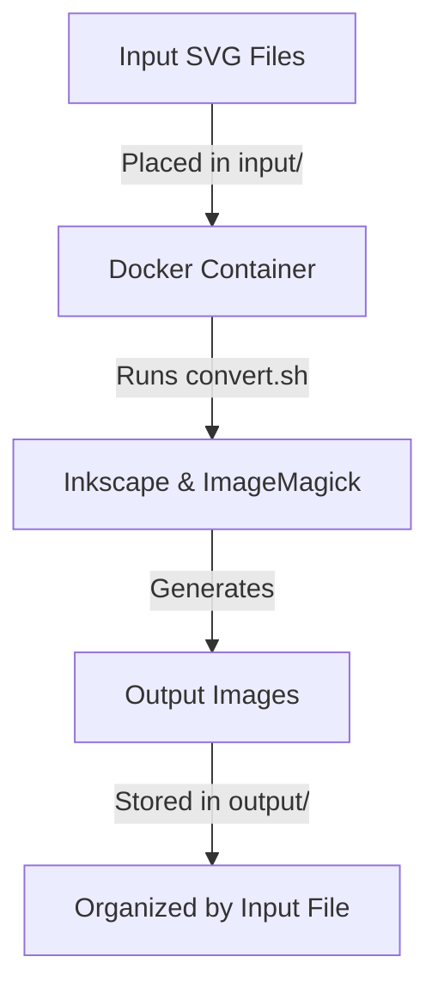

# Docker Image Conversions

This project provides a Dockerized solution for converting SVG files into multiple image formats and sizes using Inkscape and ImageMagick. The conversion process is automated through a shell script and can be easily executed within the Docker container.

## Project Structure

```plaintext
docker-compose.yml
Dockerfile
input/
    input.svg
    two.svg
output/
    input/
        input-16x16.png
        input-32x32.png
        input-48x48.png
        input.ico
    two/
        two-16x16.png
        two-32x32.png
        two-48x48.png
        two.ico
script/
    convert.sh
```

## How It Works

1. Place your SVG files in the `input/` directory.
2. Build the Docker image using the provided `Dockerfile`.
3. Run the container to execute the `convert.sh` script, which processes the SVG files and generates output images in the `output/` directory.

## Usage

### Build the Docker Image
```bash
docker build -t svg-converter .
```

### Run the Conversion
```bash
docker run --rm -v $(pwd)/input:/app/input -v $(pwd)/output:/app/output svg-converter
```

### Using Docker Compose

You can also use `docker-compose` to simplify the process:

#### Build and Run
```bash
docker-compose up --build
```

#### Stop the Containers
```bash
docker-compose down
```

## Mermaid Diagram



## Requirements

- Docker installed on your system.

## Notes

- Ensure that the `input/` and `output/` directories exist before running the container.
- The `output/` directory will be organized by the names of the input SVG files.

## Acknowledgment

This project, including its implementation and documentation, was primarily developed with the assistance of GitHub Copilot, using the GPT-4 model.
